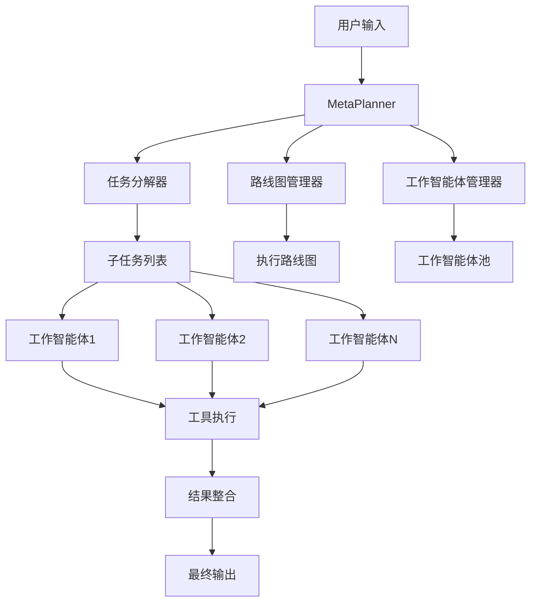
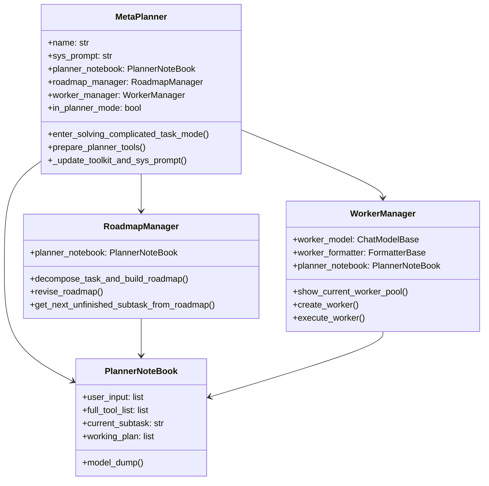
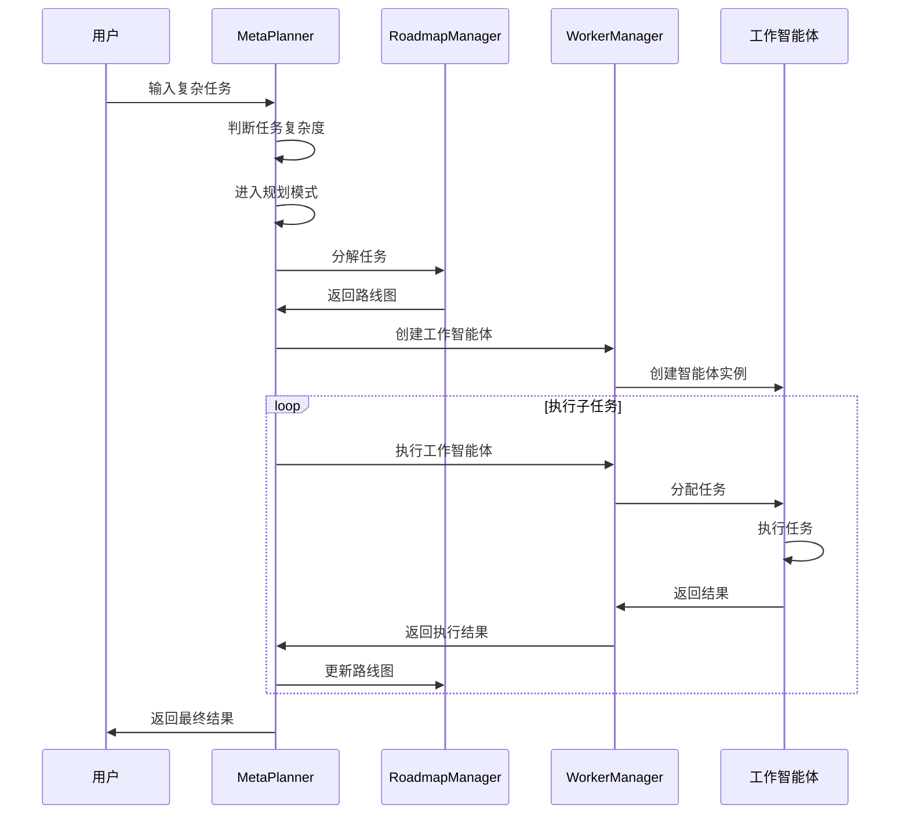
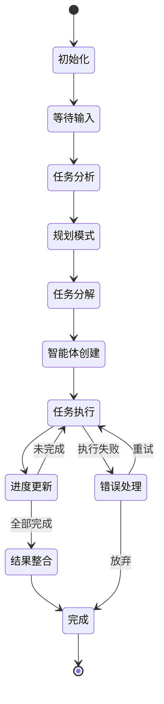

# AgentScope MetaPlanner 深度知识文档

## 📋 目录

1. [概述](#概述)
2. [核心架构](#核心架构)
3. [设计理念](#设计理念)
4. [核心组件详解](#核心组件详解)
5. [工作流程分析](#工作流程分析)
6. [钩子系统](#钩子系统)
7. [状态管理](#状态管理)
8. [工具集成](#工具集成)
9. [使用指南](#使用指南)
10. [最佳实践](#最佳实践)
11. [扩展开发](#扩展开发)
12. [故障排除](#故障排除)
13. [性能优化](#性能优化)
14. [未来展望](#未来展望)

---

## 概述

### 什么是 MetaPlanner？

AgentScope MetaPlanner 是一个基于 ReActAgent 的高级智能体，专门设计用于处理复杂的多步骤规划任务。它通过动态创建工作智能体来解决子任务，实现了"规划-执行"模式，能够将复杂问题分解为可管理的子任务，并通过协调多个工作智能体来完成整个任务。

### 核心特性

- **任务分解**：自动将复杂任务分解为可执行的子任务
- **智能体管理**：动态创建和管理工作智能体
- **状态持久化**：支持断点续传和状态恢复
- **钩子系统**：灵活的事件处理机制
- **工具集成**：丰富的工具生态系统
- **异步执行**：支持并发和异步操作

### 适用场景

- 复杂研究任务
- 多步骤项目开发
- 自动化工作流
- 智能体协作系统
- 长期规划任务

---

## 核心架构

### 架构图



### 核心组件关系



---

## 设计理念

### 1. 透明性原则

MetaPlanner 坚持 AgentScope 的"透明"设计理念：

- **过程可见**：所有规划步骤对开发者可见
- **状态可控**：开发者可以干预和调整执行过程
- **逻辑清晰**：每个决策都有明确的逻辑依据

### 2. 模块化设计

- **职责分离**：每个组件都有明确的职责
- **松耦合**：组件之间通过接口交互
- **可扩展**：易于添加新功能和组件

### 3. 状态驱动

- **状态持久化**：关键状态自动保存
- **断点续传**：支持从任意状态恢复
- **状态一致性**：确保状态转换的一致性

### 4. 事件驱动

- **钩子系统**：通过钩子函数处理事件
- **异步执行**：支持非阻塞操作
- **响应式设计**：根据事件动态调整行为

---

## 核心组件详解

### 1. MetaPlanner 主类

#### 类定义

```python
class MetaPlanner(ReActAgent):
    """
    元规划智能体，扩展 ReActAgent 以支持复杂的多步骤规划任务。
    
    通过分解任务、创建工作智能体、协调执行来实现复杂任务的自动化处理。
    """
```

#### 核心属性

```python
# 基础属性
self.agent_working_dir_root: str  # 工作目录根路径
self.task_dir: str                # 当前任务目录
self.worker_full_toolkit: Toolkit # 工作智能体完整工具包
self.state_saving_dir: str        # 状态保存目录

# 规划相关
self.planner_notebook: PlannerNoteBook  # 规划笔记本
self.roadmap_manager: RoadmapManager    # 路线图管理器
self.worker_manager: WorkerManager      # 工作智能体管理器

# 状态管理
self.state_loading_reasoning_msg: Optional[Msg]  # 状态加载消息
self.planner_mode: Literal["disable", "dynamic", "enforced"]  # 规划模式
self.in_planner_mode: bool  # 是否在规划模式
```

#### 初始化过程

```python
def __init__(self, name: str, model: ChatModelBase, worker_full_toolkit: Toolkit,
             formatter: FormatterBase, memory: MemoryBase, toolkit: Toolkit,
             agent_working_dir: str, sys_prompt: Optional[str] = None,
             max_iters: int = 10, state_saving_dir: Optional[str] = None,
             planner_mode: Literal["disable", "dynamic", "enforced"] = "dynamic"):
    
    # 1. 调用父类初始化
    super().__init__(name=name, sys_prompt=sys_prompt, model=model,
                    formatter=formatter, memory=memory, toolkit=toolkit,
                    max_iters=max_iters)
    
    # 2. 设置基础属性
    self.agent_working_dir_root = agent_working_dir
    self.task_dir = self.agent_working_dir_root
    self.worker_full_toolkit = worker_full_toolkit
    self.state_saving_dir = state_saving_dir
    
    # 3. 初始化规划组件
    if planner_mode in ["dynamic", "enforced"]:
        self.planner_notebook = PlannerNoteBook()
        self.prepare_planner_tools(planner_mode)
    
    # 4. 注册钩子函数
    self.setup_hooks()
```

### 2. PlannerNoteBook 规划笔记本

#### 功能概述

PlannerNoteBook 是 MetaPlanner 的核心数据结构，用于存储和管理规划过程中的所有信息。

#### 核心属性

```python
class PlannerNoteBook:
    user_input: list[str]           # 用户输入历史
    full_tool_list: list[dict]      # 完整工具列表
    current_subtask: str            # 当前子任务
    working_plan: list[str]         # 工作计划
    # ... 其他属性
```

#### 主要方法

```python
def model_dump(self, exclude: set = None, indent: int = 2) -> str:
    """将笔记本内容序列化为 JSON 字符串"""
    
def load_from_dict(self, data: dict) -> None:
    """从字典加载笔记本内容"""
```

### 3. RoadmapManager 路线图管理器

#### 功能概述

负责任务分解、路线图构建和进度管理。

#### 核心方法

```python
async def decompose_task_and_build_roadmap(self, task_description: str) -> dict:
    """
    分解任务并构建路线图
    
    Args:
        task_description: 任务描述
        
    Returns:
        包含子任务列表的路线图
    """
    
async def revise_roadmap(self, subtask_id: str, status: str, output: any) -> dict:
    """
    修订路线图进度
    
    Args:
        subtask_id: 子任务ID
        status: 新状态
        output: 输出结果
        
    Returns:
        更新后的路线图
    """
    
async def get_next_unfinished_subtask_from_roadmap(self) -> dict:
    """
    获取下一个未完成的子任务
    
    Returns:
        下一个子任务信息
    """
```

### 4. WorkerManager 工作智能体管理器

#### 功能概述

负责工作智能体的创建、管理和执行。

#### 核心方法

```python
async def show_current_worker_pool(self) -> dict:
    """
    显示当前工作智能体池
    
    Returns:
        工作智能体池信息
    """
    
async def create_worker(self, name: str, sys_prompt: str, tools: list) -> dict:
    """
    创建工作智能体
    
    Args:
        name: 智能体名称
        sys_prompt: 系统提示
        tools: 工具列表
        
    Returns:
        创建的智能体信息
    """
    
async def execute_worker(self, worker_id: str, task: str, input_data: any) -> dict:
    """
    执行工作智能体
    
    Args:
        worker_id: 智能体ID
        task: 任务描述
        input_data: 输入数据
        
    Returns:
        执行结果
    """
```

---

## 工作流程分析

### 1. 完整执行流程



### 2. 状态转换图



### 3. 详细执行步骤

#### 步骤 1: 任务复杂度判断

```python
# MetaPlanner 会自动判断任务是否需要进入规划模式
# 判断条件：
# 1. 任务无法在5次推理-行动迭代内完成
# 2. 任务无法用当前可见工具完成
# 3. 任务涉及综合研究或信息收集

if self._is_complex_task(user_input):
    await self.enter_solving_complicated_task_mode(task_name)
```

#### 步骤 2: 进入规划模式

```python
async def enter_solving_complicated_task_mode(self, task_name: str) -> ToolResponse:
    # 1. 确保文件系统功能可用
    self._ensure_file_system_functions()
    
    # 2. 创建任务专用目录
    self.task_dir = os.path.join(self.agent_working_dir_root, task_name)
    
    # 3. 更新工具包和系统提示
    self._update_toolkit_and_sys_prompt()
    
    # 4. 激活规划模式
    self.in_planner_mode = True
```

#### 步骤 3: 任务分解

```python
# 调用任务分解工具
roadmap = await self.roadmap_manager.decompose_task_and_build_roadmap(
    task_description=user_input,
    requirements=extracted_requirements
)
```

#### 步骤 4: 工作智能体创建

```python
# 为每个子任务创建专门的工作智能体
for subtask in roadmap.subtasks:
    worker = await self.worker_manager.create_worker(
        name=f"{subtask.name}-Worker",
        sys_prompt=self._get_worker_prompt(subtask.name),
        tools=self._get_required_tools(subtask.name)
    )
```

#### 步骤 5: 任务执行

```python
# 执行子任务
for subtask in roadmap.subtasks:
    result = await self.worker_manager.execute_worker(
        worker_id=subtask.worker_id,
        task=subtask.description,
        input_data=subtask.input
    )
    
    # 更新路线图
    await self.roadmap_manager.revise_roadmap(
        subtask_id=subtask.id,
        status="completed",
        output=result
    )
```

---

## 钩子系统

### 1. 钩子类型

MetaPlanner 支持以下钩子类型：

```python
HOOK_TYPES = [
    "pre_reply",      # 回复前
    "post_reply",     # 回复后
    "pre_reasoning",  # 推理前
    "post_reasoning", # 推理后
    "pre_action",     # 行动前
    "post_action",    # 行动后
]
```

### 2. 钩子函数实现

#### 用户输入处理钩子

```python
def update_user_input_pre_reply_hook(
    self: "MetaPlanner",
    kwargs: dict[str, Any],
) -> None:
    """将用户输入加载到规划笔记本"""
    msg = kwargs.get("msg", None)
    if isinstance(msg, Msg):
        msg = [msg]
    if isinstance(msg, list):
        for m in msg:
            self.planner_notebook.user_input.append(m.content)
```

#### 状态保存钩子

```python
def planner_save_post_reasoning_state(
    self: "MetaPlanner",
    reasoning_input: dict[str, Any],
    reasoning_output: Msg,
) -> None:
    """推理后保存状态"""
    if self.state_saving_dir:
        os.makedirs(self.state_saving_dir, exist_ok=True)
        cur_stage, _ = _infer_planner_stage_with_msg(reasoning_output)
        time_str = datetime.now().strftime("%Y%m%d%H%M%S")
        file_path = os.path.join(
            self.state_saving_dir,
            f"state-{cur_stage}-{time_str}.json",
        )
        with open(file_path, "w", encoding="utf-8") as f:
            json.dump(self.state_dict(), f, ensure_ascii=False, indent=4)
```

#### 状态加载钩子

```python
async def planner_load_state_pre_reasoning_hook(
    self: "MetaPlanner",
    *args: Any,
    **kwargs: Any,
) -> None:
    """推理前加载状态"""
    mem_msgs = await self.memory.get_memory()
    if len(mem_msgs) > 0:
        stage, _ = _infer_planner_stage_with_msg(mem_msgs[-1])
        if stage == "post_reasoning":
            self.state_loading_reasoning_msg = mem_msgs[-1]
            await self.memory.delete(len(mem_msgs) - 1)
```

### 3. 钩子注册

```python
def setup_hooks(self):
    """设置所有钩子函数"""
    # pre-reply hook
    self.register_instance_hook(
        "pre_reply",
        "update_user_input_to_notebook_pre_reply_hook",
        update_user_input_pre_reply_hook,
    )
    
    # pre-reasoning hook
    self.register_instance_hook(
        "pre_reasoning",
        "planner_load_state_pre_reasoning_hook",
        planner_load_state_pre_reasoning_hook,
    )
    
    # post-reasoning hook
    self.register_instance_hook(
        "post_reasoning",
        "planner_load_state_post_reasoning_hook",
        planner_load_state_post_reasoning_hook,
    )
    
    # post-action hook
    self.register_instance_hook(
        "post_acting",
        "save_state_post_action_hook",
        planner_save_post_action_state,
    )
```

---

## 状态管理

### 1. 状态结构

```python
class PlannerState:
    """规划器状态"""
    agent_id: str
    planner_mode: str
    in_planner_mode: bool
    current_roadmap: dict
    planner_notebook: dict
    timestamp: datetime
    stage: str  # pre_reasoning, post_reasoning, post_action
```

### 2. 状态保存

```python
def save_state(self, stage: str) -> None:
    """保存当前状态"""
    state = {
        "agent_id": self.id,
        "planner_mode": self.planner_mode,
        "in_planner_mode": self.in_planner_mode,
        "current_roadmap": self.current_roadmap,
        "planner_notebook": self.planner_notebook.model_dump(),
        "timestamp": datetime.now().isoformat(),
        "stage": stage
    }
    
    # 保存到文件
    filename = f"state-{stage}-{datetime.now().strftime('%Y%m%d%H%M%S')}.json"
    filepath = os.path.join(self.state_saving_dir, filename)
    
    with open(filepath, "w", encoding="utf-8") as f:
        json.dump(state, f, ensure_ascii=False, indent=4)
```

### 3. 状态恢复

```python
def load_state(self, filepath: str) -> None:
    """从文件恢复状态"""
    with open(filepath, "r", encoding="utf-8") as f:
        state = json.load(f)
    
    self.id = state["agent_id"]
    self.planner_mode = state["planner_mode"]
    self.in_planner_mode = state["in_planner_mode"]
    self.current_roadmap = state["current_roadmap"]
    self.planner_notebook.load_from_dict(state["planner_notebook"])
```

### 4. 断点续传

```python
async def resume_from_state(self, state_file: str) -> None:
    """从状态文件恢复执行"""
    self.load_state(state_file)
    
    # 恢复规划工具
    self.prepare_planner_tools(self.planner_mode)
    
    if self.in_planner_mode:
        self._update_toolkit_and_sys_prompt()
    
    # 继续执行未完成的任务
    next_subtask = await self.roadmap_manager.get_next_unfinished_subtask_from_roadmap()
    if next_subtask:
        await self.execute_subtask(next_subtask["id"])
```

---

## 工具集成

### 1. 工具分类

#### 基础工具
- `execute_python_code`: Python 代码执行
- `execute_shell_command`: Shell 命令执行
- `read_text_file`: 文本文件读取
- `write_text_file`: 文本文件写入

#### 规划工具
- `decompose_task_and_build_roadmap`: 任务分解
- `revise_roadmap`: 路线图修订
- `get_next_unfinished_subtask_from_roadmap`: 获取下一个子任务
- `show_current_worker_pool`: 显示工作智能体池
- `create_worker`: 创建工作智能体
- `execute_worker`: 执行工作智能体

#### 文件系统工具
- `create_directory`: 创建目录
- `list_directory`: 列出目录内容
- `edit_file`: 编辑文件
- `delete_file`: 删除文件

### 2. 工具注册

```python
def prepare_planner_tools(self, planner_mode: str) -> None:
    """准备规划工具"""
    # 清理现有工具组
    self.toolkit.remove_tool_groups("planning")
    self.toolkit.create_tool_group("planning", "Tool group for planning capability")
    
    # 注册路线图管理工具
    self.toolkit.register_tool_function(
        self.roadmap_manager.decompose_task_and_build_roadmap,
        group_name="planning",
    )
    self.toolkit.register_tool_function(
        self.roadmap_manager.revise_roadmap,
        group_name="planning",
    )
    
    # 注册工作智能体管理工具
    self.toolkit.register_tool_function(
        self.worker_manager.create_worker,
        group_name="planning",
    )
    self.toolkit.register_tool_function(
        self.worker_manager.execute_worker,
        group_name="planning",
    )
    
    # 根据模式激活工具
    if planner_mode == "dynamic":
        self.toolkit.update_tool_groups(["planning"], False)
    elif planner_mode == "enforced":
        self.toolkit.update_tool_groups(["planning"], True)
```

### 3. 工具执行

```python
async def execute_tool(self, tool_name: str, input_data: dict) -> any:
    """执行工具"""
    try:
        # 获取工具函数
        tool_func = self.toolkit.get_tool_function(tool_name)
        
        # 执行工具
        result = await tool_func(input_data)
        
        # 记录执行日志
        self.logger.info(f"Tool {tool_name} executed successfully")
        
        return result
    except Exception as e:
        self.logger.error(f"Tool {tool_name} execution failed: {str(e)}")
        raise
```

---

## 使用指南

### 1. 基础使用

#### 创建 MetaPlanner

```python
from agentscope.agent import MetaPlanner
from agentscope.model import DashScopeChatModel
from agentscope.formatter import DashScopeChatFormatter
from agentscope.memory import InMemoryMemory
from agentscope.tool import Toolkit

# 创建基础组件
model = DashScopeChatModel(
    model_name="qwen-max",
    api_key=os.environ["DASHSCOPE_API_KEY"],
    stream=True,
)
formatter = DashScopeChatFormatter()
memory = InMemoryMemory()
base_toolkit = Toolkit()
worker_toolkit = Toolkit()

# 创建 MetaPlanner
meta_planner = MetaPlanner(
    name="Task-Planner",
    model=model,
    worker_full_toolkit=worker_toolkit,
    formatter=formatter,
    memory=memory,
    toolkit=base_toolkit,
    agent_working_dir="./projects",
    planner_mode="dynamic",
    max_iters=20,
    state_saving_dir="./states",
)
```

#### 执行复杂任务

```python
# 用户输入
user_msg = Msg("用户", "帮我开发一个个人博客网站", "user")

# MetaPlanner 自动处理
response = await meta_planner(user_msg)
```

### 2. 高级配置

#### 自定义系统提示

```python
custom_sys_prompt = """
你是一个专业的项目规划师，擅长将复杂项目分解为可管理的子任务。

你的核心能力：
1. 需求分析和任务分解
2. 技术选型和架构设计
3. 进度管理和质量控制
4. 团队协调和资源分配

请根据用户的需求，制定详细的执行计划。
"""

meta_planner = MetaPlanner(
    name="Custom-Planner",
    sys_prompt=custom_sys_prompt,
    # ... 其他参数
)
```

#### 自定义工具

```python
# 添加自定义工具
def custom_analysis_tool(input_data: dict) -> dict:
    """自定义分析工具"""
    # 实现自定义逻辑
    return {"result": "analysis completed"}

meta_planner.toolkit.register_tool_function(
    custom_analysis_tool,
    group_name="custom",
)
```

### 3. 状态管理

#### 保存状态

```python
# 自动保存（通过钩子函数）
# 手动保存
await meta_planner.save_state("manual_save")
```

#### 恢复状态

```python
# 从状态文件恢复
await meta_planner.resume_from_state("./states/state-post_reasoning-20240115103000.json")
```

---

## 最佳实践

### 1. 任务分解原则

#### 粒度控制
- **适中粒度**：每个子任务 10-15 步完成
- **独立性**：子任务之间相对独立
- **可测试性**：每个子任务都有明确的输出

#### 依赖关系
- **明确依赖**：清楚定义子任务间的依赖关系
- **并行执行**：无依赖的子任务可以并行执行
- **关键路径**：识别关键路径，优化执行顺序

### 2. 工作智能体设计

#### 专业化分工
```python
# 需求分析智能体
requirements_agent = {
    "name": "Requirements-Analyst",
    "sys_prompt": "你是一个需求分析专家，擅长分析用户需求并制定详细的功能规划。",
    "tools": ["web_search", "write_text_file", "read_text_file"],
    "specialization": "需求分析"
}

# 前端开发智能体
frontend_agent = {
    "name": "Frontend-Developer",
    "sys_prompt": "你是一个前端开发专家，精通HTML、CSS、JavaScript和现代前端框架。",
    "tools": ["write_text_file", "execute_shell_command", "read_text_file"],
    "specialization": "前端开发"
}
```

#### 工具配置
- **最小工具集**：为每个智能体配置最小必要的工具集
- **权限控制**：限制智能体的操作权限
- **安全考虑**：避免危险操作

### 3. 错误处理

#### 重试机制
```python
async def execute_with_retry(self, func, max_retries=3, delay=1):
    """带重试的执行函数"""
    for attempt in range(max_retries):
        try:
            return await func()
        except Exception as e:
            if attempt == max_retries - 1:
                raise
            await asyncio.sleep(delay * (2 ** attempt))
```

#### 错误恢复
```python
async def handle_execution_error(self, error: Exception, subtask_id: str):
    """处理执行错误"""
    # 记录错误
    self.logger.error(f"Subtask {subtask_id} failed: {str(error)}")
    
    # 尝试恢复
    if isinstance(error, ToolExecutionError):
        # 工具执行错误，尝试替代方案
        await self.try_alternative_tools(subtask_id)
    elif isinstance(error, TimeoutError):
        # 超时错误，增加超时时间重试
        await self.retry_with_longer_timeout(subtask_id)
    else:
        # 其他错误，标记为失败
        await self.mark_subtask_failed(subtask_id, str(error))
```

### 4. 性能优化

#### 并发执行
```python
async def execute_parallel_subtasks(self, subtasks: list):
    """并行执行无依赖的子任务"""
    tasks = []
    for subtask in subtasks:
        if not self.has_dependencies(subtask):
            task = asyncio.create_task(self.execute_subtask(subtask.id))
            tasks.append(task)
    
    results = await asyncio.gather(*tasks, return_exceptions=True)
    return results
```

#### 资源管理
```python
class ResourceManager:
    """资源管理器"""
    def __init__(self, max_workers=5):
        self.max_workers = max_workers
        self.active_workers = 0
        self.semaphore = asyncio.Semaphore(max_workers)
    
    async def acquire_worker(self):
        """获取工作智能体资源"""
        await self.semaphore.acquire()
        self.active_workers += 1
    
    async def release_worker(self):
        """释放工作智能体资源"""
        self.semaphore.release()
        self.active_workers -= 1
```

---

## 扩展开发

### 1. 自定义规划器

```python
class CustomMetaPlanner(MetaPlanner):
    """自定义元规划器"""
    
    def __init__(self, *args, **kwargs):
        super().__init__(*args, **kwargs)
        self.custom_components = {}
    
    async def custom_task_decomposition(self, task: str) -> dict:
        """自定义任务分解逻辑"""
        # 实现自定义分解逻辑
        pass
    
    def setup_custom_hooks(self):
        """设置自定义钩子"""
        self.register_instance_hook(
            "pre_reasoning",
            "custom_pre_reasoning_hook",
            self.custom_pre_reasoning_hook,
        )
    
    async def custom_pre_reasoning_hook(self, *args, **kwargs):
        """自定义推理前钩子"""
        # 实现自定义逻辑
        pass
```

### 2. 自定义工具

```python
class CustomTool:
    """自定义工具基类"""
    
    def __init__(self, name: str, description: str):
        self.name = name
        self.description = description
    
    async def execute(self, input_data: dict) -> dict:
        """执行工具"""
        raise NotImplementedError
    
    def get_schema(self) -> dict:
        """获取工具模式"""
        return {
            "type": "function",
            "function": {
                "name": self.name,
                "description": self.description,
                "parameters": self.get_parameters_schema()
            }
        }
    
    def get_parameters_schema(self) -> dict:
        """获取参数模式"""
        return {}

# 具体工具实现
class DatabaseTool(CustomTool):
    """数据库操作工具"""
    
    def __init__(self):
        super().__init__("database_query", "执行数据库查询")
    
    async def execute(self, input_data: dict) -> dict:
        query = input_data.get("query")
        # 执行数据库查询
        result = await self.execute_query(query)
        return {"result": result}
    
    def get_parameters_schema(self) -> dict:
        return {
            "type": "object",
            "properties": {
                "query": {
                    "type": "string",
                    "description": "SQL查询语句"
                }
            },
            "required": ["query"]
        }
```

### 3. 插件系统

```python
class PluginManager:
    """插件管理器"""
    
    def __init__(self):
        self.plugins = {}
    
    def register_plugin(self, name: str, plugin: Plugin):
        """注册插件"""
        self.plugins[name] = plugin
    
    def load_plugin(self, name: str, config: dict):
        """加载插件"""
        if name in self.plugins:
            plugin = self.plugins[name]
            plugin.configure(config)
            return plugin
        else:
            raise ValueError(f"Plugin {name} not found")
    
    def get_plugin(self, name: str) -> Plugin:
        """获取插件"""
        return self.plugins.get(name)

class Plugin:
    """插件基类"""
    
    def __init__(self, name: str):
        self.name = name
        self.config = {}
    
    def configure(self, config: dict):
        """配置插件"""
        self.config.update(config)
    
    async def initialize(self):
        """初始化插件"""
        pass
    
    async def cleanup(self):
        """清理插件"""
        pass
```

---

## 故障排除

### 1. 常见问题

#### 问题 1: 任务分解失败

**症状**：
```
Task decomposition failed: Invalid JSON response
```

**原因**：
- LLM 返回的 JSON 格式不正确
- 任务描述过于复杂或模糊

**解决方案**：
```python
# 1. 检查任务描述
if len(task_description) > 1000:
    task_description = task_description[:1000] + "..."

# 2. 使用更明确的提示
decomposition_prompt = f"""
请将以下任务分解为具体的子任务，每个子任务应该是独立可执行的：

任务描述：{task_description}

请严格按照以下JSON格式返回：
{{
    "subtasks": [
        {{
            "name": "子任务名称",
            "description": "详细描述",
            "estimated_steps": 10
        }}
    ]
}}
"""
```

#### 问题 2: 工作智能体创建失败

**症状**：
```
Worker creation failed: Tool not found
```

**原因**：
- 工具未正确注册
- 工具名称不匹配

**解决方案**：
```python
# 1. 检查工具注册
def ensure_tools_registered(self):
    required_tools = ["read_file", "write_file", "execute_code"]
    for tool in required_tools:
        if tool not in self.worker_toolkit.tools:
            raise ValueError(f"Required tool {tool} not registered")

# 2. 验证工具名称
def validate_tool_name(self, tool_name: str) -> bool:
    return tool_name in self.worker_toolkit.tools
```

#### 问题 3: 状态恢复失败

**症状**：
```
State restoration failed: Invalid state file
```

**原因**：
- 状态文件损坏
- 版本不兼容

**解决方案**：
```python
# 1. 验证状态文件
def validate_state_file(self, filepath: str) -> bool:
    try:
        with open(filepath, 'r') as f:
            state = json.load(f)
        required_fields = ["agent_id", "planner_mode", "timestamp"]
        return all(field in state for field in required_fields)
    except:
        return False

# 2. 备份和恢复
def backup_state(self):
    backup_path = f"{self.state_saving_dir}/backup_{datetime.now().strftime('%Y%m%d%H%M%S')}.json"
    shutil.copy(self.current_state_file, backup_path)
```

### 2. 调试技巧

#### 启用详细日志

```python
import logging

# 设置日志级别
logging.basicConfig(level=logging.DEBUG)

# 创建日志器
logger = logging.getLogger("MetaPlanner")

# 在关键位置添加日志
logger.debug(f"Starting task decomposition: {task_description}")
logger.info(f"Created {len(subtasks)} subtasks")
logger.warning(f"Subtask {subtask_id} failed, retrying...")
logger.error(f"Critical error: {error_message}")
```

#### 状态检查点

```python
def add_checkpoint(self, name: str, data: dict):
    """添加检查点"""
    checkpoint = {
        "name": name,
        "timestamp": datetime.now().isoformat(),
        "data": data
    }
    
    checkpoint_file = f"{self.state_saving_dir}/checkpoint_{name}.json"
    with open(checkpoint_file, 'w') as f:
        json.dump(checkpoint, f, indent=2)
    
    self.logger.info(f"Checkpoint {name} saved")
```

#### 性能监控

```python
import time
from functools import wraps

def monitor_performance(func):
    """性能监控装饰器"""
    @wraps(func)
    async def wrapper(*args, **kwargs):
        start_time = time.time()
        try:
            result = await func(*args, **kwargs)
            execution_time = time.time() - start_time
            logger.info(f"{func.__name__} executed in {execution_time:.2f}s")
            return result
        except Exception as e:
            execution_time = time.time() - start_time
            logger.error(f"{func.__name__} failed after {execution_time:.2f}s: {str(e)}")
            raise
    return wrapper

# 使用装饰器
@monitor_performance
async def decompose_task(self, task_description: str):
    # 任务分解逻辑
    pass
```

---

## 性能优化

### 1. 并发优化

#### 异步执行

```python
async def execute_subtasks_concurrently(self, subtasks: list):
    """并发执行子任务"""
    # 创建任务
    tasks = []
    for subtask in subtasks:
        if not self.has_dependencies(subtask):
            task = asyncio.create_task(
                self.execute_subtask(subtask.id)
            )
            tasks.append(task)
    
    # 等待所有任务完成
    results = await asyncio.gather(*tasks, return_exceptions=True)
    
    # 处理结果
    for i, result in enumerate(results):
        if isinstance(result, Exception):
            logger.error(f"Subtask {subtasks[i].id} failed: {result}")
        else:
            logger.info(f"Subtask {subtasks[i].id} completed")
    
    return results
```

#### 资源池管理

```python
class WorkerPool:
    """工作智能体池"""
    
    def __init__(self, max_size: int = 10):
        self.max_size = max_size
        self.workers = []
        self.available = asyncio.Queue()
        self.busy = set()
    
    async def get_worker(self) -> Worker:
        """获取工作智能体"""
        if not self.available.empty():
            return await self.available.get()
        
        if len(self.workers) < self.max_size:
            worker = await self.create_worker()
            self.workers.append(worker)
            return worker
        
        # 等待可用工作智能体
        return await self.available.get()
    
    async def return_worker(self, worker: Worker):
        """归还工作智能体"""
        self.busy.discard(worker.id)
        await self.available.put(worker)
```

### 2. 内存优化

#### 流式处理

```python
async def process_large_dataset(self, dataset: list):
    """流式处理大数据集"""
    batch_size = 100
    results = []
    
    for i in range(0, len(dataset), batch_size):
        batch = dataset[i:i + batch_size]
        batch_results = await self.process_batch(batch)
        results.extend(batch_results)
        
        # 清理内存
        del batch
        if i % 1000 == 0:
            gc.collect()
    
    return results
```

#### 缓存机制

```python
from functools import lru_cache
import hashlib

class CacheManager:
    """缓存管理器"""
    
    def __init__(self, max_size: int = 1000):
        self.cache = {}
        self.max_size = max_size
    
    def get_cache_key(self, data: dict) -> str:
        """生成缓存键"""
        data_str = json.dumps(data, sort_keys=True)
        return hashlib.md5(data_str.encode()).hexdigest()
    
    def get(self, key: str):
        """获取缓存"""
        return self.cache.get(key)
    
    def set(self, key: str, value: any):
        """设置缓存"""
        if len(self.cache) >= self.max_size:
            # 清理最旧的缓存
            oldest_key = next(iter(self.cache))
            del self.cache[oldest_key]
        
        self.cache[key] = value
```

### 3. 网络优化

#### 连接池

```python
import aiohttp

class HTTPClient:
    """HTTP客户端"""
    
    def __init__(self, max_connections: int = 100):
        self.connector = aiohttp.TCPConnector(
            limit=max_connections,
            limit_per_host=30
        )
        self.session = None
    
    async def __aenter__(self):
        self.session = aiohttp.ClientSession(connector=self.connector)
        return self
    
    async def __aexit__(self, exc_type, exc_val, exc_tb):
        if self.session:
            await self.session.close()
    
    async def request(self, method: str, url: str, **kwargs):
        """发送请求"""
        async with self.session.request(method, url, **kwargs) as response:
            return await response.json()
```

#### 重试机制

```python
import asyncio
from tenacity import retry, stop_after_attempt, wait_exponential

class RetryableClient:
    """可重试的客户端"""
    
    @retry(
        stop=stop_after_attempt(3),
        wait=wait_exponential(multiplier=1, min=4, max=10)
    )
    async def make_request(self, url: str, **kwargs):
        """发送可重试的请求"""
        async with aiohttp.ClientSession() as session:
            async with session.get(url, **kwargs) as response:
                if response.status >= 500:
                    raise aiohttp.ClientError(f"Server error: {response.status}")
                return await response.json()
```

---

## 未来展望

### 1. 技术发展方向

#### 多模态支持
- **图像理解**：支持图像输入和生成
- **音频处理**：语音识别和合成
- **视频分析**：视频内容理解和生成

#### 分布式执行
- **集群部署**：支持多机器部署
- **负载均衡**：智能任务分配
- **容错机制**：自动故障恢复

#### 实时协作
- **多用户支持**：多用户同时使用
- **实时同步**：状态实时同步
- **协作编辑**：多人协作编辑

### 2. 功能扩展

#### 智能优化
- **自动调优**：自动优化执行参数
- **学习能力**：从历史执行中学习
- **预测分析**：预测任务执行时间

#### 可视化界面
- **图形化界面**：Web界面管理
- **实时监控**：执行过程可视化
- **交互式调试**：可视化调试工具

#### 企业级功能
- **权限管理**：细粒度权限控制
- **审计日志**：完整的操作日志
- **合规支持**：满足企业合规要求

### 3. 生态系统

#### 插件市场
- **工具插件**：丰富的工具插件
- **模板库**：预定义的任务模板
- **最佳实践**：社区最佳实践分享

#### 开发者工具
- **SDK**：完整的开发工具包
- **文档生成**：自动生成API文档
- **测试框架**：专门的测试框架

#### 社区支持
- **开源社区**：活跃的开源社区
- **技术支持**：专业的技术支持
- **培训认证**：官方培训认证

---

## 总结

AgentScope MetaPlanner 是一个功能强大、设计精良的元规划智能体框架。它通过巧妙的架构设计、完善的钩子系统、灵活的状态管理，实现了复杂的多步骤任务自动化处理能力。

### 核心优势

1. **架构清晰**：模块化设计，职责分明
2. **功能完整**：覆盖任务规划的全生命周期
3. **扩展性强**：易于定制和扩展
4. **状态可恢复**：支持长时间运行和断点续传
5. **工具丰富**：完整的工具生态系统

### 适用场景

- 复杂项目开发
- 自动化工作流
- 智能体协作
- 长期规划任务
- 研究和分析任务

### 学习建议

1. **从基础开始**：先掌握 ReActAgent 的基本用法
2. **理解架构**：深入理解各个组件的职责和关系
3. **实践应用**：通过实际项目加深理解
4. **扩展开发**：尝试开发自定义组件和工具
5. **社区参与**：参与开源社区，分享经验

MetaPlanner 代表了 AI 智能体技术的一个重要发展方向，为构建复杂的自动化系统提供了强大的基础。随着技术的不断发展，它将在更多领域发挥重要作用。

---

*本文档基于 AgentScope v1.0.2 版本编写，如有更新请参考最新官方文档。*

