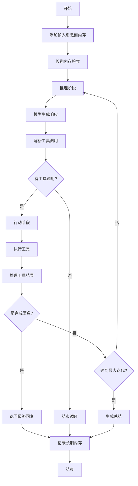

# ReActAgent - Node.js TypeScript 实现

一个功能完整的 ReAct (Reasoning and Acting) Agent 实现，使用 TypeScript 开发，支持工具调用、实时控制、结构化输出等高级功能。

## 🚀 特性

- **完整的 ReAct 算法实现** - 推理与行动的循环执行
- **工具系统** - 内置多种实用工具，支持自定义工具
- **Hook 系统** - 完整的生命周期 Hook 支持
- **内存管理** - 短期和长期内存支持
- **流式输出** - 支持实时流式响应
- **并行工具调用** - 提升执行效率
- **结构化输出** - 基于 Zod Schema 的结构化数据输出
- **多模型支持** - 支持 OpenAI 等多种 LLM 提供商
- **TypeScript** - 完整的类型安全支持
- **中文支持** - 完整的中文注释和文档

## 📦 安装

```bash
# 克隆项目
git clone <repository-url>
cd ReActAgent

# 安装依赖
npm install

# 构建项目
npm run build
```

## 🔧 快速开始

### 基础使用

```typescript
import { createCodeAssistantAgent, UserAgent } from '@agentscope/react-agent';

// 创建代码助手 Agent
const agent = createCodeAssistantAgent(
  'CodeHelper',
  process.env.OPENAI_API_KEY!
);

// 创建用户 Agent
const user = new UserAgent();

// 开始对话
async function chat() {
  let msg = null;
  while (true) {
    msg = await user.reply(msg);
    if (msg.getTextContent() === 'exit') break;
    
    msg = await agent.reply(msg);
  }
}

chat();
```

### 高级配置

```typescript
import { ReActAgent, OpenAIChatModel, OpenAIChatFormatter, Toolkit } from '@agentscope/react-agent';

// 创建模型
const model = new OpenAIChatModel({
  model_name: 'gpt-4',
  api_key: process.env.OPENAI_API_KEY!,
  temperature: 0.7,
  stream: true
});

// 创建格式化器
const formatter = new OpenAIChatFormatter();

// 创建工具包
const toolkit = new Toolkit();
// 添加自定义工具...

// 创建 Agent
const agent = new ReActAgent({
  name: 'MyAgent',
  sys_prompt: '你是一个智能助手...',
  model,
  formatter,
  toolkit,
  max_iters: 10,
  parallel_tool_calls: true
});
```

## 🛠️ 内置工具

- **executeShellCommand** - 执行 Shell 命令
- **executePythonCode** - 执行 Python 代码
- **viewTextFile** - 查看文本文件
- **writeTextFile** - 写入文本文件
- **listDirectory** - 列出目录内容
- **getSystemInfo** - 获取系统信息

## 📖 API 文档

### ReActAgent

主要的 Agent 类，实现完整的 ReAct 算法。

```typescript
class ReActAgent extends ReActAgentBase {
  constructor(config: AgentConfig)
  
  // 生成回复
  async reply(msg?: IMessage | IMessage[] | null, structuredModel?: StructuredModel): Promise<IMessage>
  
  // 观察消息
  async observe(msg: IMessage | IMessage[] | null): Promise<void>
  
  // 更新系统提示词
  updateSystemPrompt(newPrompt: string): void
  
  // 获取内存统计
  async getMemoryStats(): Promise<MemoryStats>
}
```

### 工具系统

```typescript
// 创建工具包
const toolkit = new Toolkit();

// 注册工具函数
toolkit.registerToolFunction(myToolFunction);

// 注册带元数据的工具
toolkit.registerToolWithMetadata(
  myToolFunction,
  'tool_name',
  '工具描述',
  parameterSchema
);

// 获取工具 Schema
const schemas = toolkit.getJsonSchemas();
```

### Hook 系统

```typescript
// 注册实例级 Hook
agent.registerInstanceHook('pre_reply', 'myHook', (agent, kwargs) => {
  // Hook 逻辑
  return modifiedKwargs;
});

// 注册类级 Hook
ReActAgent.registerClassHook('ClassName', 'pre_reply', 'myHook', hookFunction);
```

## 🔄 代码流程

### ReAct 循环流程



### 类继承结构

```
AgentBase (基础Agent类)
├── Hook系统支持
├── 消息打印功能
├── 订阅者管理
└── 生命周期管理

ReActAgentBase (ReAct基础类)
├── 继承AgentBase
├── 推理/行动抽象方法
├── 推理/行动Hook支持
└── 扩展Hook类型

ReActAgent (完整实现)
├── 继承ReActAgentBase
├── 完整ReAct循环
├── 工具调用支持
├── 内存管理
├── 结构化输出
└── 并行处理
```

## 🧪 运行示例

```bash
# 设置环境变量
export OPENAI_API_KEY=your_api_key_here

# 运行基础示例
npm run dev basic

# 运行高级功能示例
npm run dev advanced

# 运行结构化输出示例
npm run dev structured

# 运行并行工具调用示例
npm run dev parallel

# 运行所有示例
npm run dev all
```

## 📁 项目结构

```
src/
├── agent/              # Agent 相关类
│   ├── AgentBase.ts    # Agent 基础类
│   ├── ReActAgentBase.ts # ReAct Agent 基础类
│   ├── ReActAgent.ts   # ReAct Agent 实现
│   └── UserAgent.ts    # 用户 Agent
├── message/            # 消息系统
│   └── Message.ts      # 消息类实现
├── memory/             # 内存系统
│   └── InMemoryMemory.ts # 内存实现
├── tool/               # 工具系统
│   ├── Toolkit.ts      # 工具包
│   ├── ToolResponse.ts # 工具响应
│   └── builtin/        # 内置工具
├── model/              # 模型系统
│   └── OpenAIChatModel.ts # OpenAI 模型
├── formatter/          # 格式化器
│   └── OpenAIChatFormatter.ts
├── types/              # 类型定义
│   └── index.ts
├── utils/              # 工具函数
│   └── index.ts
├── examples/           # 使用示例
│   ├── factory.ts      # Agent 工厂
│   └── main.ts         # 主示例
└── index.ts            # 主入口
```

## 🤝 贡献

欢迎提交 Issue 和 Pull Request！

## 📄 许可证

MIT License

## 🙏 致谢

本项目基于 [AgentScope](https://github.com/modelscope/agentscope) 的 Python 实现，使用 TypeScript 重新实现。


