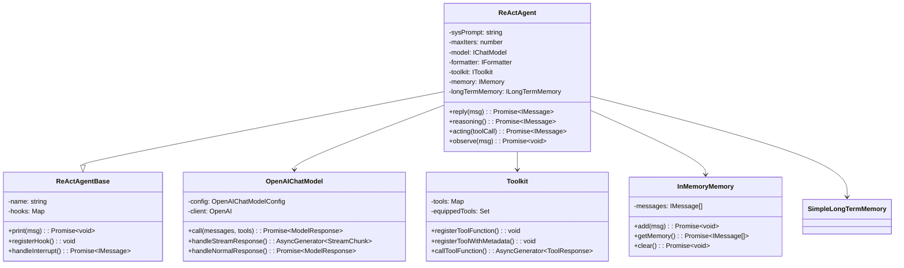

# ReActAgent 技术文档

## 目录
1. [系统概述](#系统概述)
2. [架构设计](#架构设计)
3. [核心功能](#核心功能)
4. [ReAct算法实现](#react算法实现)
5. [工具系统](#工具系统)
6. [内存管理](#内存管理)
7. [流式响应处理](#流式响应处理)
8. [配置与扩展](#配置与扩展)
9. [错误处理与监控](#错误处理与监控)
10. [使用场景与最佳实践](#使用场景与最佳实践)
11. [技术优势与局限性](#技术优势与局限性)
12. [部署与运维](#部署与运维)

--

## 系统概述

ReActAgent是一个基于ReAct（Reasoning and Acting）算法的智能代理系统，采用TypeScript开发，支持工具调用、流式响应、双层内存管理等高级功能。系统设计遵循模块化架构，提供灵活的配置选项和强大的扩展能力。

### 核心特性
- **ReAct推理循环**：实现完整的推理-行动-观察循环
- **工具调用系统**：支持内置工具和自定义工具
- **双层内存架构**：短期内存和长期内存结合
- **流式响应处理**：实时交互体验
- **模块化设计**：清晰的组件分离
- **灵活配置**：支持多种配置选项

---

## 架构设计

### 系统架构图


### 组件关系图



---

## 核心功能

### 1. ReAct推理循环

ReActAgent实现了完整的ReAct算法，包括三个核心阶段：

#### 推理阶段（Reasoning）
- 分析当前状态和用户输入
- 决定需要执行什么行动
- 生成工具调用指令
- 处理模型响应和工具调用

#### 行动阶段（Acting）
- 执行具体的工具调用
- 获取工具执行结果
- 处理执行过程中的错误
- 支持并行工具调用

#### 观察阶段（Observation）
- 观察行动结果
- 更新内部状态
- 为下一轮推理提供信息
- 管理内存和上下文

### 2. 工具调用系统

#### 工具注册机制
```typescript
// 函数式工具注册
toolkit.registerToolFunction(func, name);

// 带元数据的工具注册
toolkit.registerToolWithMetadata(
  func,
  name,
  description,
  parameters
);
```

#### 内置工具集合
1. **executeShellCommand**：执行Shell命令
2. **executePythonCode**：执行Python代码
3. **viewTextFile**：查看文本文件
4. **writeTextFile**：写入文本文件
5. **listDirectory**：列出目录内容
6. **getSystemInfo**：获取系统信息

### 3. 双层内存架构

#### 短期内存（InMemoryMemory）
- 存储当前对话的上下文
- 基于消息列表的简单实现
- 支持消息的添加、获取、清空操作

#### 长期内存（SimpleLongTermMemory）
- 持久化存储重要信息
- 支持关键词检索
- 两种控制模式：agent_control、static_control、both

---

## ReAct算法实现

### 算法流程图


### 核心实现代码

```typescript
async reply(msg?: IMessage | IMessage[] | null): Promise<IMessage> {
  // 添加输入消息到内存
  await this.memory.add(msg || null);

  // 长期内存检索（静态控制模式）
  if (this.staticControl) {
    const retrievedInfo = await this.longTermMemory!.retrieve(msg || null);
    if (retrievedInfo) {
      const longTermMemoryMsg = MessageFactory.createUserMessage(
        `<long_term_memory>以下内容来自长期内存，可能有用：\n${retrievedInfo}</long_term_memory>`,
        'long_term_memory'
      );
      await this.memory.add(longTermMemoryMsg);
    }
  }

  // 开始推理-行动循环
  let replyMsg: IMessage | null = null;
  
  for (let iteration = 0; iteration < this.maxIters; iteration++) {
    // 推理阶段
    const reasoningMsg = await this.reasoningWithHooks();

    // 获取所有工具调用
    const toolCalls = reasoningMsg.getContentBlocks<ToolUseBlock>('tool_use');
    
    if (toolCalls.length === 0) {
      break;
    }

    // 行动阶段 - 执行工具调用
    const actingPromises = toolCalls.map(toolCall => this.actingWithHooks(toolCall));

    let actingResponses: (IMessage | null)[];
    if (this.parallelToolCalls) {
      // 并行执行工具调用
      actingResponses = await Promise.all(actingPromises);
    } else {
      // 顺序执行工具调用
      actingResponses = [];
      for (const promise of actingPromises) {
        actingResponses.push(await promise);
      }
    }

    // 查找第一个非空的回复消息
    for (const actingMsg of actingResponses) {
      if (actingMsg) {
        replyMsg = actingMsg;
        break;
      }
    }

    if (replyMsg) {
      break;
    }
  }

  // 如果达到最大迭代次数仍无回复，生成总结
  if (!replyMsg) {
    replyMsg = await this.summarizing();
  }

  // 长期内存记录（静态控制模式）
  if (this.staticControl) {
    const allMessages = [
      ...(msg ? ensureArray(msg) : []),
      ...(await this.memory.getMemory()),
      replyMsg
    ];
    await this.longTermMemory!.record(allMessages);
  }

  // 添加回复消息到内存
  await this.memory.add(replyMsg);
  
  return replyMsg;
}
```

---

## 工具系统

### 工具架构图


### 工具执行流程


### 工具注册示例

```typescript
// 注册内置工具
toolkit.registerToolWithMetadata(
  executeShellCommand,
  'execute_shell_command',
  '执行Shell命令并返回结果',
  {
    type: 'object',
    properties: {
      command: { type: 'string', description: '要执行的Shell命令' },
      workingDir: { type: 'string', description: '工作目录，默认为当前目录' },
      timeout: { type: 'number', description: '超时时间（毫秒），默认30000' }
    },
    required: ['command']
  }
);

// 注册自定义工具
toolkit.registerToolWithMetadata(
  myCustomFunction,
  'my_custom_tool',
  '我的自定义工具',
  {
    type: 'object',
    properties: {
      input: { type: 'string', description: '输入参数' }
    },
    required: ['input']
  }
);
```

---

## 内存管理

### 内存架构图


### 内存操作流程


### 内存配置示例

```typescript
// 创建内存实例
const memory = new InMemoryMemory();
const longTermMemory = new SimpleLongTermMemory();

// 配置长期内存模式
const config: AgentConfig = {
  name: 'MyAgent',
  sys_prompt: 'You are a helpful assistant.',
  model,
  formatter,
  toolkit,
  memory,
  long_term_memory: longTermMemory,
  long_term_memory_mode: 'both', // 'agent_control' | 'static_control' | 'both'
  // ... 其他配置
};
```

---

## 流式响应处理

### 流式响应架构


### 流式响应处理代码

```typescript
private async *handleStreamResponse(
  params: OpenAI.Chat.ChatCompletionCreateParams
): AsyncGenerator<StreamChunk> {
  const stream = await this.client.chat.completions.create({
    ...params,
    stream: true
  });

  let textContent = '';
  let toolCalls: ToolUseBlock[] = [];

  for await (const chunk of stream) {
    const choice = chunk.choices[0];
    if (!choice) continue;

    const delta = choice.delta;
    let content: ContentBlock[] = [];
    let isLast = false;

    // 处理文本内容
    if (delta.content) {
      textContent += delta.content;
      content.push(createTextBlock(textContent));
    }

    // 处理工具调用
    if (delta.tool_calls) {
      for (const toolCallDelta of delta.tool_calls) {
        const index = toolCallDelta.index || 0;
        
        if (!toolCalls[index]) {
          toolCalls[index] = createToolUseBlock('', {}, toolCallDelta.id || '');
        }

        const toolCall = toolCalls[index];
        
        if (toolCallDelta.function?.name) {
          toolCall.name = toolCallDelta.function.name;
        }
        
        if (toolCallDelta.function?.arguments) {
          if (!toolCall.input.__arguments) {
            toolCall.input.__arguments = '';
          }
          toolCall.input.__arguments += toolCallDelta.function.arguments;
        }
      }
      
      // 尝试解析完整的工具调用
      for (const toolCall of toolCalls) {
        if (toolCall.input.__arguments) {
          try {
            const args = JSON.parse(toolCall.input.__arguments);
            toolCall.input = args;
            delete toolCall.input.__arguments;
          } catch {
            // 参数还不完整，继续等待
          }
        }
      }

      content.push(...toolCalls);
    }

    // 检查是否结束
    if (choice.finish_reason) {
      isLast = true;
    }

    yield {
      content,
      is_last: isLast
    };

    if (isLast) break;
  }
}
```

### 流式响应问题诊断


---

## 配置与扩展

### 配置层次结构


### 工厂模式设计


### 扩展机制

#### Hook系统
```typescript
// 注册Hook
agent.registerInstanceHook(
  'pre_print',
  'my_hook',
  (agent, kwargs) => {
    // Hook逻辑
    return kwargs;
  }
);

// Hook类型
type HookType = 'pre_print' | 'post_print' | 'pre_reasoning' | 'post_reasoning';
```

#### 自定义工具
```typescript
// 自定义工具函数
async function* myCustomTool(input: string): AsyncGenerator<ToolResponse> {
  try {
    // 工具逻辑
    const result = await processInput(input);
    yield new ToolResponse(result, { success: true }, true);
  } catch (error) {
    yield new ToolResponse(`错误: ${error}`, { success: false }, true);
  }
}

// 注册自定义工具
toolkit.registerToolWithMetadata(
  myCustomTool,
  'my_custom_tool',
  '我的自定义工具',
  {
    type: 'object',
    properties: {
      input: { type: 'string', description: '输入参数' }
    },
    required: ['input']
  }
);
```

---

## 错误处理与监控

### 错误处理层次


### 错误恢复策略


### 监控和日志

```typescript
// 日志记录器
export class Logger {
  private prefix: string;
  
  constructor(prefix: string = 'ReActAgent') {
    this.prefix = prefix;
  }
  
  private formatMessage(level: string, message: string, ...args: any[]): string {
    const timestamp = new Date().toISOString();
    const formattedArgs = args.length > 0 ? ' ' + args.map(arg => 
      typeof arg === 'object' ? safeJsonStringify(arg) : String(arg)
    ).join(' ') : '';
    return `[${timestamp}] [${this.prefix}] [${level}] ${message}${formattedArgs}`;
  }
  
  debug(message: string, ...args: any[]): void {
    console.debug(this.formatMessage('DEBUG', message, ...args));
  }
  
  info(message: string, ...args: any[]): void {
    console.info(this.formatMessage('INFO', message, ...args));
  }
  
  warn(message: string, ...args: any[]): void {
    console.warn(this.formatMessage('WARN', message, ...args));
  }
  
  error(message: string, ...args: any[]): void {
    console.error(this.formatMessage('ERROR', message, ...args));
  }
}
```

---

## 使用场景与最佳实践

### 主要应用场景


### 最佳实践

#### 1. 配置优化
```typescript
// 代码助手配置
const codeAgent = createCodeAssistantAgent(
  'CodeHelper',
  apiKey,
  {
    modelName: 'deepseek-chat',
    temperature: 0.3,        // 较低温度，更确定性
    maxTokens: 4096,         // 足够的token数
    stream: false,           // 避免流式响应问题
    maxIters: 15,            // 足够的迭代次数
    enableBuiltinTools: true,
    enableLongTermMemory: true,
    longTermMemoryMode: 'both'
  }
);

// 研究助手配置
const researchAgent = createResearchAssistantAgent(
  'ResearchBot',
  apiKey,
  {
    temperature: 0.5,        // 中等温度，平衡创造性和准确性
    parallelToolCalls: true, // 启用并行工具调用
    enableMetaTool: true,    // 启用元工具
    maxIters: 20             // 更多迭代次数
  }
);
```

#### 2. 工具使用
```typescript
// 安全工具执行
async function* safeShellCommand(command: string): AsyncGenerator<ToolResponse> {
  // 命令白名单检查
  const allowedCommands = ['ls', 'pwd', 'cat', 'grep'];
  const baseCommand = command.split(' ')[0];
  
  if (!allowedCommands.includes(baseCommand)) {
    yield new ToolResponse('命令不在允许列表中', { success: false }, true);
    return;
  }
  
  // 执行命令
  try {
    const { stdout, stderr } = await execAsync(command, { timeout: 30000 });
    yield new ToolResponse(stdout || stderr, { success: true }, true);
  } catch (error) {
    yield new ToolResponse(`执行失败: ${error.message}`, { success: false }, true);
  }
}
```

#### 3. 内存管理
```typescript
// 内存清理策略
async function cleanupMemory(agent: ReActAgent) {
  const stats = await agent.getMemoryStats();
  
  // 如果短期内存过大，清理旧消息
  if (stats.shortTermSize > 100) {
    await agent.clearMemory(false); // 只清理短期内存
  }
  
  // 如果长期内存过大，清理旧条目
  if (stats.longTermStats && stats.longTermStats.totalEntries > 1000) {
    // 实现长期内存清理逻辑
  }
}
```

#### 4. 错误处理
```typescript
// 错误处理包装器
async function safeReply(agent: ReActAgent, msg: IMessage): Promise<IMessage> {
  try {
    return await agent.reply(msg);
  } catch (error) {
    logger.error('Agent回复失败:', error);
    
    // 返回友好的错误消息
    return new Message(
      agent.name,
      '抱歉，处理您的请求时遇到了问题。请稍后重试。',
      'assistant'
    );
  }
}
```

---

## 技术优势与局限性

### 技术优势


### 技术局限性

```mermaid
mindmap
  root((ReActAgent局限性))
    流式响应稳定性
      可能阻塞问题
      格式不匹配
      超时处理不足
    内存管理复杂度
      双层内存开销
      状态同步问题
      清理策略复杂
    工具安全性风险
      外部命令执行
      代码执行风险
      权限控制不足
    性能开销
      复杂推理循环
      多次API调用
      内存占用较大
    外部依赖
      OpenAI/DeepSeek API
      网络连接要求
      服务可用性依赖
    扩展性限制
      工具注册复杂度
      配置选项过多
      学习曲线陡峭
```



### 改进方向

1. **流式响应优化**
   - 改进异步迭代器处理
   - 增强错误恢复机制
   - 添加超时和重试逻辑

2. **安全性增强**
   - 实现工具执行沙箱
   - 添加权限控制机制
   - 增强输入验证

3. **性能优化**
   - 优化内存使用
   - 减少API调用次数
   - 实现缓存机制

4. **易用性改进**
   - 简化配置选项
   - 提供更多预设配置
   - 改进错误提示

---

## 部署与运维

### 部署架构


### 环境配置

```bash
# 环境变量配置
export OPENAI_API_KEY="your-openai-api-key"
export DEEPSEEK_API_KEY="your-deepseek-api-key"
export LOG_LEVEL="info"
export LOG_DIR="./logs"
export PORT=3000
export HOST="localhost"
export CORS_ORIGIN="*"
export DATABASE_URL="sqlite:./data/react-agent.db"
```

### 监控指标

```typescript
// 性能指标收集
interface PerformanceMetrics {
  // API调用指标
  apiCallCount: number;
  apiCallDuration: number;
  apiCallErrors: number;
  
  // 工具执行指标
  toolExecutionCount: number;
  toolExecutionDuration: number;
  toolExecutionErrors: number;
  
  // 内存使用指标
  memoryUsage: number;
  memoryLeaks: number;
  
  // 响应时间指标
  averageResponseTime: number;
  maxResponseTime: number;
  minResponseTime: number;
}
```

### 运维最佳实践

1. **日志管理**
   - 结构化日志记录
   - 日志轮转和清理
   - 敏感信息脱敏

2. **监控告警**
   - 关键指标监控
   - 异常情况告警
   - 性能趋势分析

3. **备份恢复**
   - 定期数据备份
   - 配置备份
   - 灾难恢复计划

4. **安全防护**
   - API密钥管理
   - 访问控制
   - 安全审计

---

## 总结

ReActAgent是一个功能强大、架构清晰的智能代理系统，实现了完整的ReAct算法，提供了丰富的工具系统和灵活的内存管理。虽然存在一些技术局限性，但通过合理的配置和优化，可以满足多种应用场景的需求。

### 核心价值
- **智能化**：基于ReAct算法的智能推理
- **工具化**：丰富的工具调用能力
- **可扩展**：灵活的配置和扩展机制
- **可维护**：清晰的模块化架构

### 适用场景
- 代码助手和开发工具
- 研究助手和数据分析
- 通用智能助手
- 自动化任务处理

### 发展方向
- 提升流式响应稳定性
- 增强安全性和可靠性
- 优化性能和资源使用
- 简化配置和使用体验

通过持续的技术改进和优化，ReActAgent有望成为更加成熟和实用的智能代理系统。
