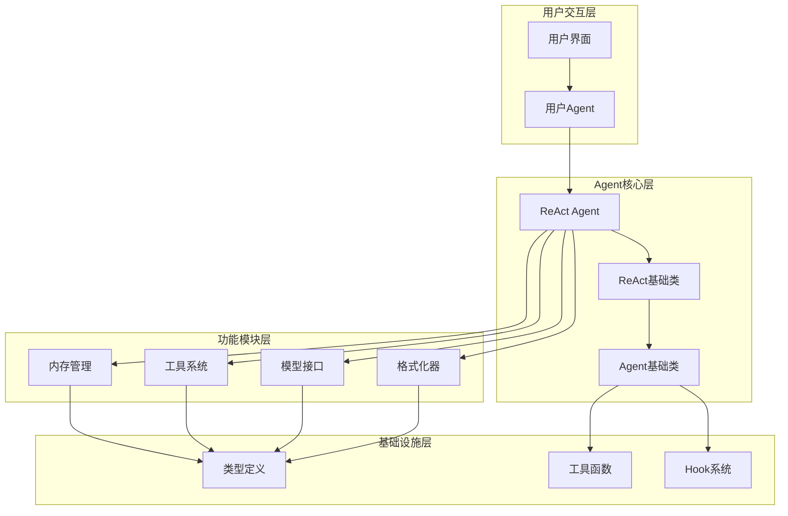
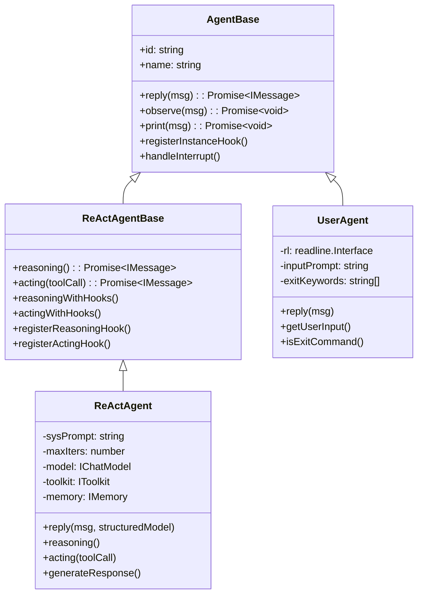
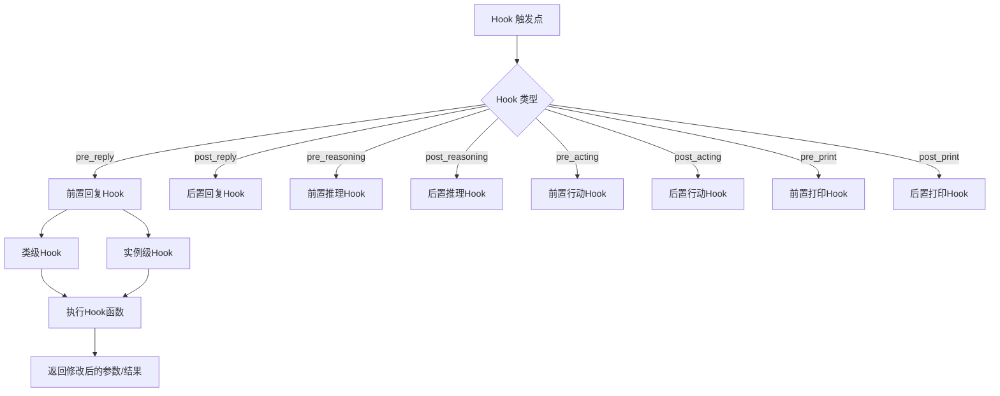
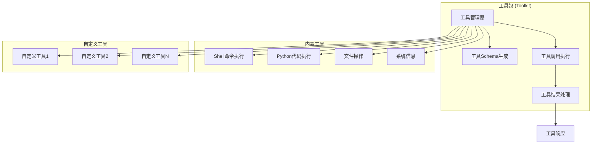
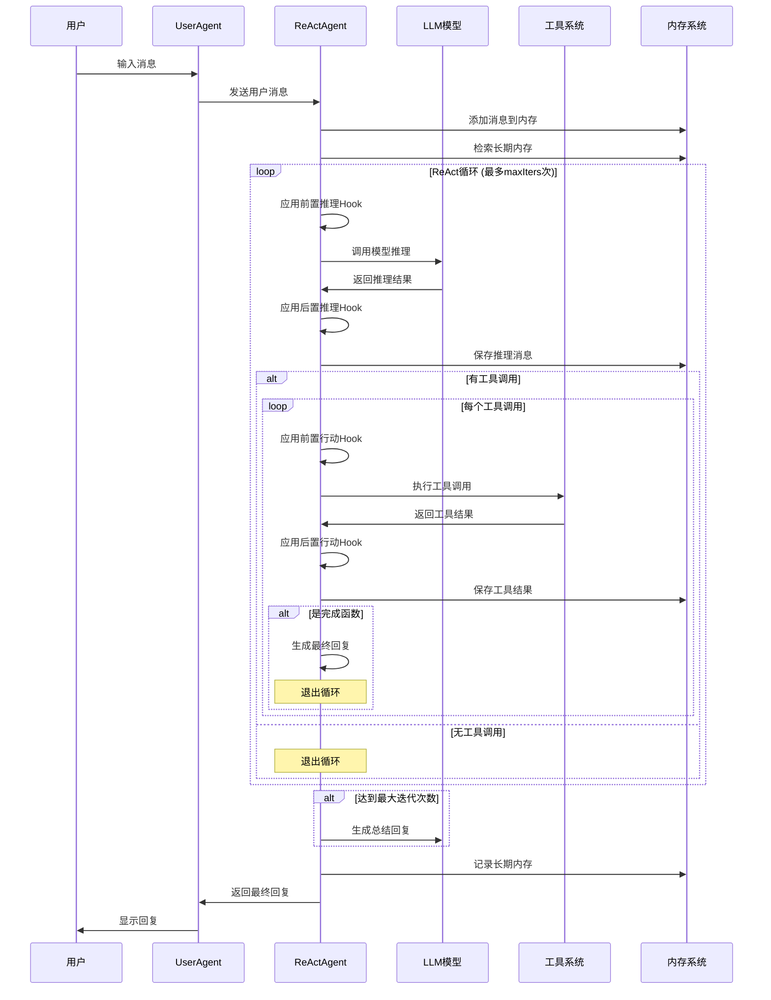
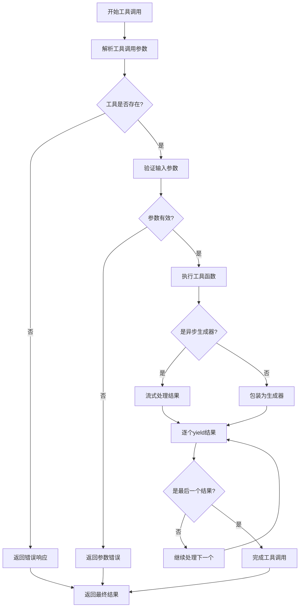
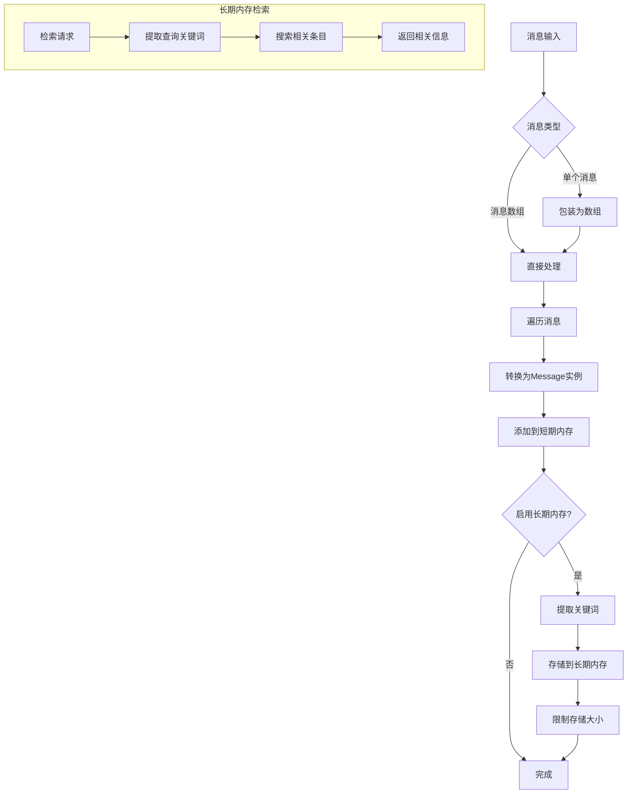
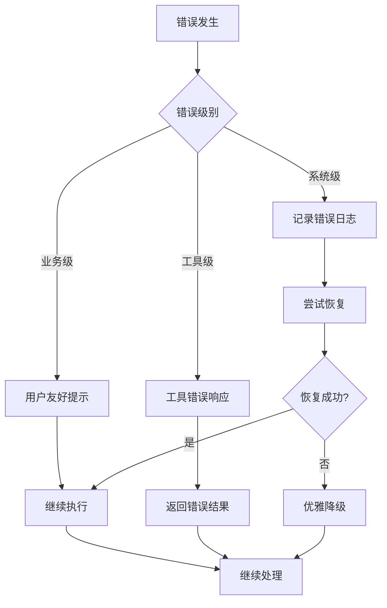

# ReActAgent 架构设计文档

## 系统架构概览

ReActAgent 采用模块化设计，主要包含以下几个核心模块：



## 核心组件详解

### 1. Agent 类层次结构



### 2. Hook 系统架构



### 3. 工具系统架构



## 核心流程详解

### 1. ReAct 主循环流程



### 2. 工具调用流程



### 3. 内存管理流程



## 设计模式应用

### 1. 策略模式 (Strategy Pattern)

```typescript
// 不同的格式化策略
interface IFormatter {
  format(msgs: IMessage[]): Promise<IMessage[] | string>;
}

class OpenAIChatFormatter implements IFormatter { ... }
class SimpleFormatter implements IFormatter { ... }
class StringFormatter implements IFormatter { ... }
```

### 2. 观察者模式 (Observer Pattern)

```typescript
// Hook系统实现观察者模式
class AgentBase {
  private subscribers: Map<string, IAgent[]> = new Map();
  
  async broadcastToSubscribers(msg: IMessage): Promise<void> {
    for (const [hubName, subscribers] of this.subscribers.entries()) {
      for (const subscriber of subscribers) {
        await subscriber.observe(msg);
      }
    }
  }
}
```

### 3. 工厂模式 (Factory Pattern)

```typescript
// Agent工厂函数
export function createCodeAssistantAgent(
  name: string,
  openaiApiKey: string,
  options?: Partial<QuickCreateOptions>
): ReActAgent {
  // 创建和配置各种组件
  const model = new OpenAIChatModel({ ... });
  const formatter = new OpenAIChatFormatter();
  const toolkit = new Toolkit();
  
  return new ReActAgent({ ... });
}
```

### 4. 装饰器模式 (Decorator Pattern)

```typescript
// Hook系统作为装饰器
protected async reasoningWithHooks(...args: any[]): Promise<IMessage> {
  // 前置Hook装饰
  const modifiedArgs = await this.applyPreReasoningHooks({ args });
  
  // 核心逻辑
  let result = await this.reasoning(...(modifiedArgs?.args || args));
  
  // 后置Hook装饰
  const finalResult = await this.applyPostReasoningHooks({ args }, result);
  return finalResult || result;
}
```

## 性能优化设计

### 1. 并行工具调用

```typescript
// 支持并行和串行两种模式
if (this.parallelToolCalls) {
  // 并行执行所有工具调用
  actingResponses = await Promise.all(actingPromises);
} else {
  // 串行执行工具调用
  actingResponses = [];
  for (const promise of actingPromises) {
    actingResponses.push(await promise);
  }
}
```

### 2. 流式处理

```typescript
// 支持流式输出以提升用户体验
if (this.model.stream) {
  for await (const chunk of response) {
    msg.setContent(chunk.content);
    await this.print(msg, false); // 实时打印
  }
  await this.print(msg, true); // 最终打印
}
```

### 3. 内存优化

```typescript
// 长期内存限制大小防止内存泄漏
if (entries.length > this.maxEntries) {
  entries.shift(); // 移除最旧的条目
}
```

## 错误处理机制

### 1. 分层错误处理



### 2. 错误恢复策略

```typescript
// 工具调用错误处理
try {
  const result = await this.toolkit.callToolFunction(toolCall);
  // 处理正常结果
} catch (error) {
  logger.error(`工具调用失败: ${toolCall.name}`, error);
  // 创建错误响应，但不中断整个流程
  const errorResponse = createErrorResponse(`工具调用失败: ${error}`);
  yield errorResponse;
}
```

## 扩展性设计

### 1. 插件化架构

系统支持通过以下方式进行扩展：

- **自定义工具**: 实现 `ToolFunction` 接口
- **自定义模型**: 实现 `IChatModel` 接口  
- **自定义格式化器**: 实现 `IFormatter` 接口
- **自定义内存**: 实现 `IMemory` 接口
- **自定义Hook**: 注册到Hook系统

### 2. 配置驱动

```typescript
// 通过配置对象控制行为
const config: AgentConfig = {
  name: 'MyAgent',
  sys_prompt: '...',
  model: customModel,
  formatter: customFormatter,
  toolkit: customToolkit,
  memory: customMemory,
  max_iters: 10,
  parallel_tool_calls: true,
  enable_meta_tool: true
};
```

这种架构设计确保了系统的：
- **可维护性**: 模块化设计，职责分离
- **可扩展性**: 接口驱动，插件化架构
- **可测试性**: 依赖注入，Mock友好
- **性能**: 并行处理，流式输出
- **健壮性**: 分层错误处理，优雅降级
