# ReActAgent 代码流程详细说明

## 1. 整体流程概览

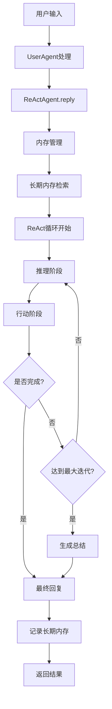

## 2. ReActAgent.reply() 详细流程

### 2.1 初始化阶段

```typescript
async reply(msg?: IMessage | IMessage[] | null, structuredModel?: StructuredModel): Promise<IMessage> {
    // 1. 添加输入消息到内存
    await this.memory.add(msg);

    // 2. 长期内存检索（静态控制模式）
    if (this.staticControl) {
        const retrievedInfo = await this.longTermMemory!.retrieve(msg);
        if (retrievedInfo) {
            const longTermMemoryMsg = MessageFactory.createUserMessage(
                `<long_term_memory>以下内容来自长期内存，可能有用：\n${retrievedInfo}</long_term_memory>`,
                'long_term_memory'
            );
            await this.memory.add(longTermMemoryMsg);
        }
    }

    // 3. 设置结构化输出模型
    this.requiredStructuredModel = structuredModel;
    if (structuredModel) {
        this.toolkit.setExtendedModel(this.finishFunctionName, structuredModel);
    }
    
    // 4. 开始ReAct循环...
}
```

### 2.2 ReAct循环详细流程

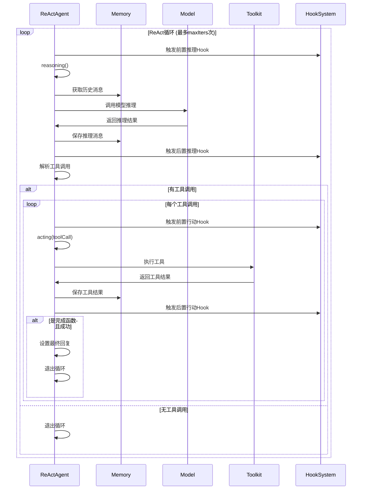

## 3. 推理阶段 (reasoning) 详细流程

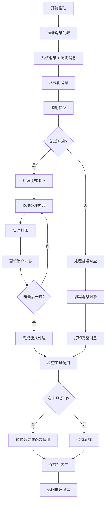

### 推理阶段代码实现：

```typescript
async reasoning(): Promise<IMessage> {
    // 1. 准备消息
    const messages = [
        MessageFactory.createSystemMessage(this.systemPrompt),
        ...(await this.memory.getMemory())
    ];

    // 2. 格式化消息
    const formattedMessages = await this.formatter.format(messages);
    
    // 3. 调用模型
    const response = await this.model.call(
        formattedMessages,
        this.toolkit.getJsonSchemas()
    );

    let msg: IMessage;

    // 4. 处理模型响应
    if (this.isAsyncGenerator(response)) {
        // 流式响应处理
        msg = new Message(this.name, [], 'assistant');
        
        for await (const chunk of response) {
            msg.setContent(chunk.content);
            await this.print(msg, false);
        }
        await this.print(msg, true);
    } else {
        // 普通响应处理
        msg = new Message(this.name, response.content, 'assistant');
        await this.print(msg, true);
    }

    // 5. 如果没有工具调用，转换为完成函数调用
    if (!msg.hasContentBlocks('tool_use')) {
        const textContent = msg.getTextContent();
        msg.setContent([
            createToolUseBlock(
                this.finishFunctionName,
                { response: textContent },
                generateShortUuid()
            )
        ]);
    }

    // 6. 添加到内存
    await this.memory.add(msg);
    
    return msg;
}
```

## 4. 行动阶段 (acting) 详细流程

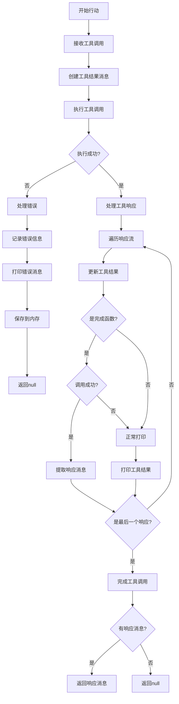

### 行动阶段代码实现：

```typescript
async acting(toolCall: ToolUseBlock): Promise<IMessage | null> {
    // 1. 创建工具结果消息
    const toolResultMsg = MessageFactory.createToolResultMessage([
        createToolResultBlock(toolCall.id, toolCall.name, [])
    ]);

    let responseMsg: IMessage | null = null;

    try {
        // 2. 执行工具调用
        const toolResponseGenerator = await this.toolkit.callToolFunction(toolCall);
        
        // 3. 处理工具响应
        for await (const chunk of toolResponseGenerator) {
            // 更新工具结果
            (toolResultMsg.content[0] as ToolResultBlock).output = chunk.content;

            // 跳过完成函数的打印（除非失败）
            if (
                toolCall.name !== this.finishFunctionName ||
                !chunk.metadata.success
            ) {
                await this.print(toolResultMsg, chunk.is_last);
            }

            // 如果是成功的完成函数调用，返回响应消息
            if (
                toolCall.name === this.finishFunctionName &&
                chunk.metadata.success
            ) {
                responseMsg = chunk.metadata.response_msg;
            }
        }

    } catch (error) {
        logger.error(`工具调用失败: ${toolCall.name}`, error);
        (toolResultMsg.content[0] as ToolResultBlock).output = `工具调用失败: ${error}`;
        await this.print(toolResultMsg, true);
    } finally {
        // 记录工具结果消息到内存
        await this.memory.add(toolResultMsg);
    }

    return responseMsg;
}
```

## 5. 工具系统详细流程

### 5.1 工具调用流程

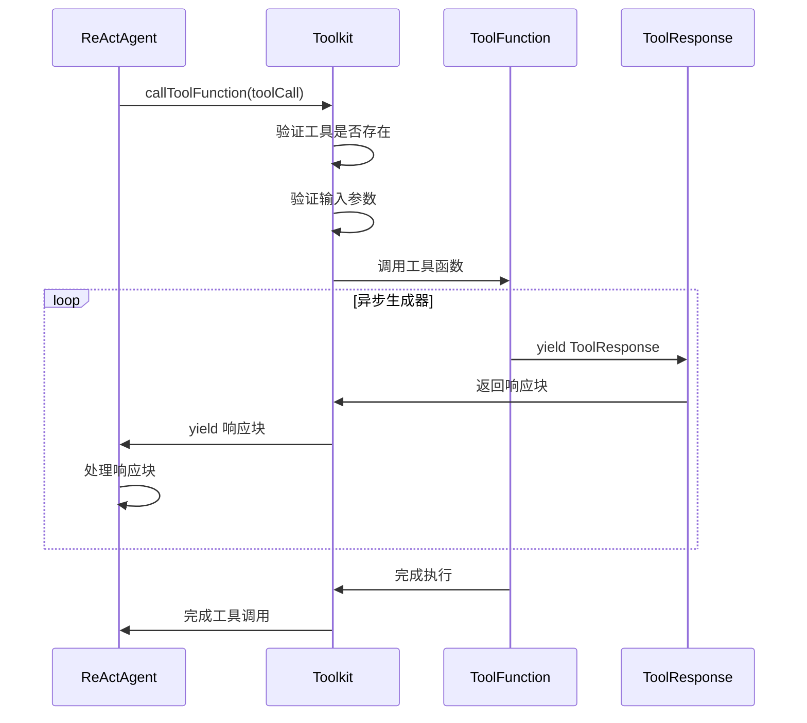

### 5.2 内置工具执行流程

以 `executeShellCommand` 为例：

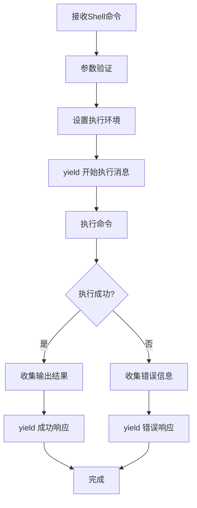

## 6. 内存管理详细流程

### 6.1 短期内存 (InMemoryMemory)

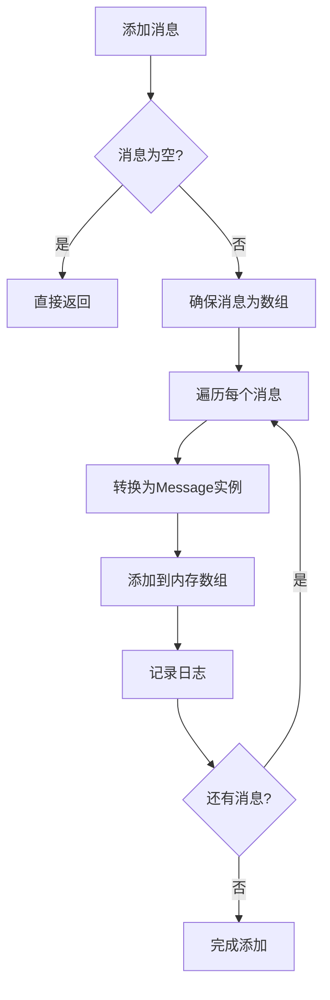

### 6.2 长期内存 (SimpleLongTermMemory)

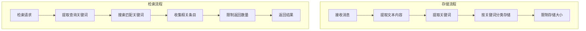

## 7. Hook系统详细流程

### 7.1 Hook执行流程

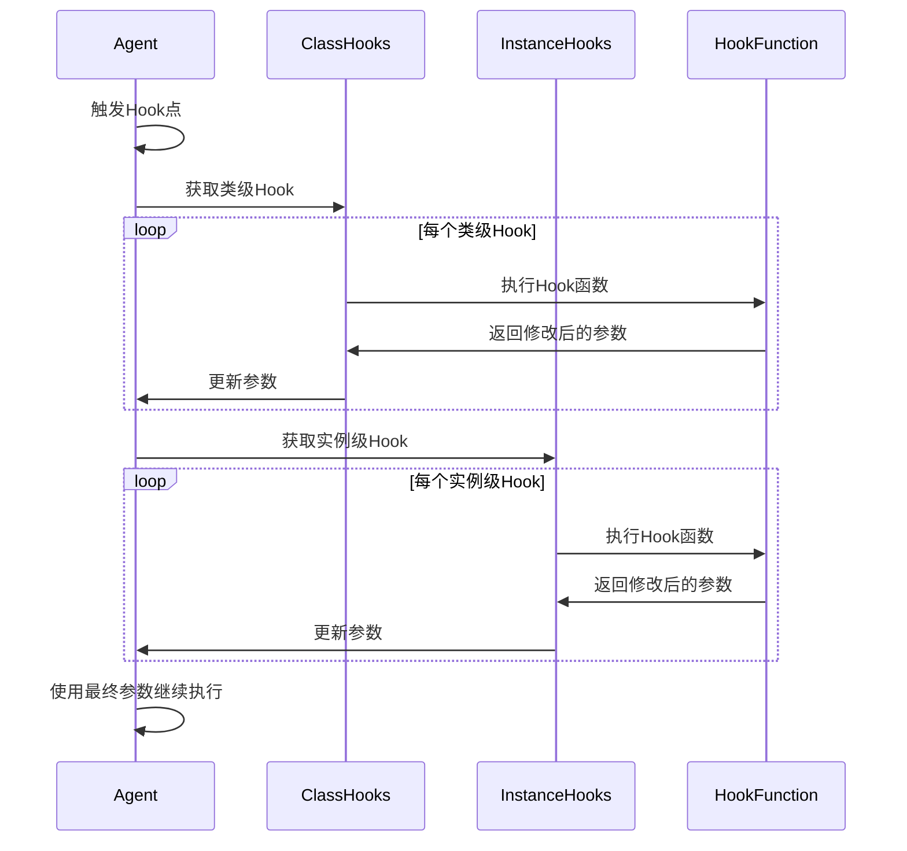

### 7.2 Hook注册和管理

```typescript
// Hook注册示例
class ReActAgent extends ReActAgentBase {
    constructor(config: AgentConfig) {
        super(config.name);
        
        // 注册完成函数的打印Hook
        this.registerInstanceHook(
            'pre_print',
            'finish_function_pre_print_hook',
            finishFunctionPrePrintHook
        );
    }
}

// Hook函数实现
function finishFunctionPrePrintHook(
    agent: ReActAgent,
    kwargs: Record<string, any>
): Record<string, any> | null {
    const { msg } = kwargs;
    
    // Hook逻辑：检查是否为完成函数调用
    if (Array.isArray(msg.content)) {
        for (let i = 0; i < msg.content.length; i++) {
            const block = msg.content[i];
            if (block.type === 'tool_use' && block.name === agent.finishFunctionName) {
                // 转换为文本显示
                msg.content[i] = createTextBlock(block.input?.response || '');
                return kwargs;
            }
        }
    }
    
    return null;
}
```

## 8. 错误处理和恢复流程

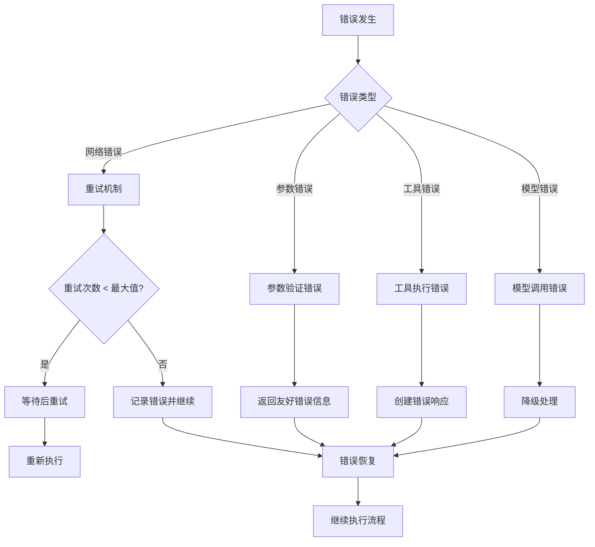

## 9. 性能优化流程

### 9.1 并行工具调用

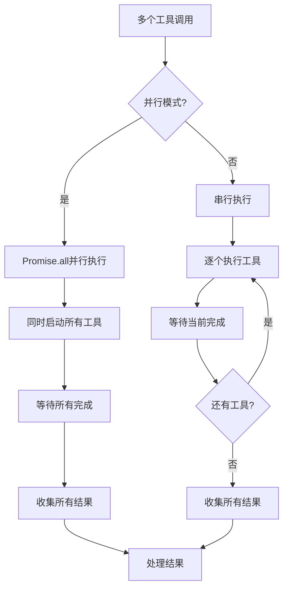

### 9.2 流式输出优化

```typescript
// 流式输出实现
if (this.model.stream) {
    msg = new Message(this.name, [], 'assistant');
    
    for await (const chunk of response) {
        msg.setContent(chunk.content);
        await this.print(msg, false); // 实时显示
    }
    await this.print(msg, true); // 最终确认
}
```

## 10. 总结

ReActAgent的核心流程特点：

1. **模块化设计**: 每个组件职责清晰，易于维护和扩展
2. **异步处理**: 全面采用异步编程，提升性能
3. **流式输出**: 支持实时响应，提升用户体验
4. **错误恢复**: 完善的错误处理机制，保证系统稳定性
5. **Hook系统**: 灵活的扩展机制，支持自定义行为
6. **内存管理**: 短期和长期内存结合，支持上下文保持
7. **工具集成**: 丰富的内置工具，支持自定义扩展
8. **并行优化**: 支持并行工具调用，提升执行效率

这种设计确保了系统既功能强大又易于使用和扩展。


